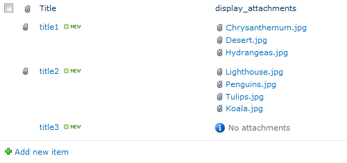
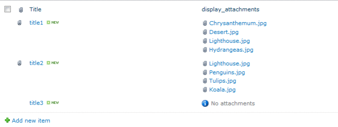
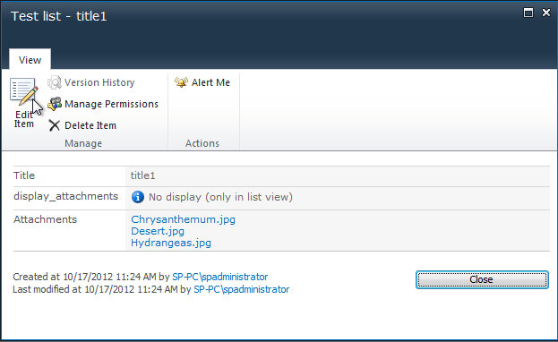
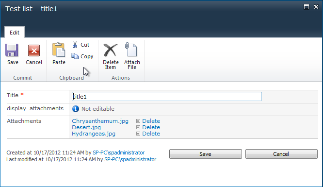

**Display attachments (SP 2010)** is a field column for all type lists (not support the following list type: Document library, Image library, Links, Surveys). This control displays attachments in list view.
 

**How does it work?**
 

**Version 1.0.0:**
* Display attachments for list item in list view
* Async loading attachments using library jQuery 1.8.2
* Use sharepoint webservice (/_vti_bin/Lists.asmx)
* Simple in use
* Simple installation
* Work on:
	* SharePoint Foundation 2010
	* Sharepoint Server 2010 (Standard, Enterprise)
* Localized: 
	* English
	* Russian

**Installation**
Follow these instructions on how to [install](http://spattachmentfield.codeplex.com/documentation) 
Display attachments for SP 2010

**Requirements**
* For Use
	* Internet Explorer 8.0 and higher
	* FireFox 14.0 and higher
	* Chrome 22.0 and higher
* For Development
	* IDE - Visual Studio 2010
	* SharePoint Foundation 2010 / SharePoint Server 2010 (Standard, Enterprise)

**How does it look like?**
In list view:
 
In disp form:
 
In edit form:
 

